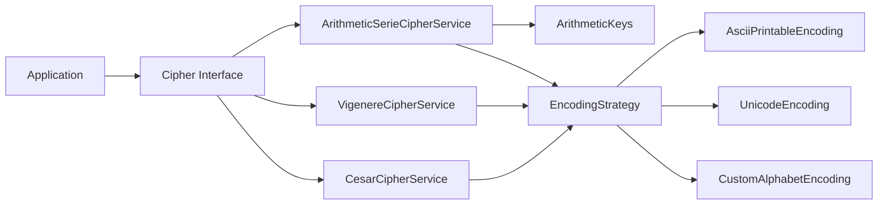

# 🔐 Carnet de Contacts Sécurisé — Module de Cryptographie Java


Projet pédagogique illustrant la conception d’un **module de cryptographie extensible en Java** dans le cadre d’un **carnet de contacts sécurisé**.

---

# 📑 Sommaire

- [Présentation](#présentation)
- [Architecture du projet](#architecture-du-projet)
- [Interface Cipher](#interface-cipher)
- [Chiffrement par série arithmétique](#chiffrement-par-série-arithmétique)
- [Gestion des clés](#gestion-des-clés)
- [Pattern Strategy pour l'encodage](#pattern-strategy-pour-lencodage)
- [Diagramme UML](#diagramme-uml)
- [Exemple d'utilisation](#exemple-dutilisation)
- [Preuve de réversibilité](#preuve-de-réversibilité)
- [Comparaison des algorithmes](#comparaison-des-algorithmes)
- [Objectifs pédagogiques](#objectifs-pédagogiques)
- [Évolutions possibles](#évolutions-possibles)
- [Public cible](#public-cible)
- [Licence](#licence)

---

# 📌 Présentation

Ce module permet d’expérimenter plusieurs **algorithmes de chiffrement classiques** :

- Chiffrement de **César**
- Chiffrement de **Vigenère**
- Chiffrement basé sur une **série arithmétique**

Le projet met l’accent sur :

- la **qualité de l’architecture**
- la **réutilisabilité du code**
- la **séparation des responsabilités**

---

# 🧱 Architecture du projet

Le cœur du système repose sur une interface commune à tous les algorithmes :

```java
Cipher

Les implémentations concrètes utilisent :

une stratégie d'encodage

une clé spécifique à l’algorithme

Schéma d’architecture


