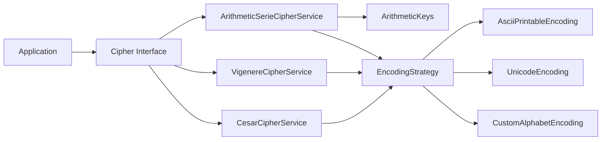
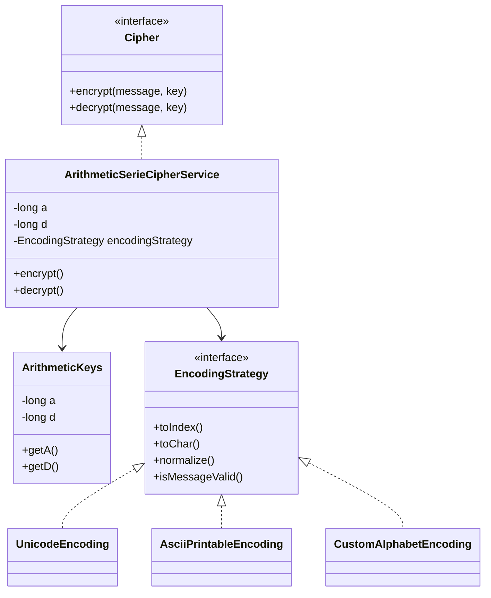
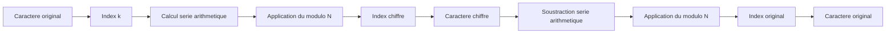
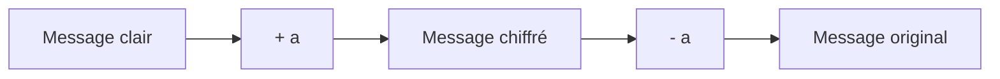
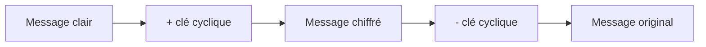
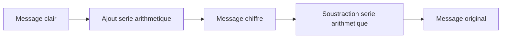

# 🔐 Carnet de Contacts Sécurisé — Module de Cryptographie Java


Projet pédagogique illustrant la conception d’un **module de cryptographie extensible en Java** dans le cadre d’un **carnet de contacts sécurisé**.

---

# 📑 Sommaire

- [Présentation](#présentation)
- [Architecture du projet](#architecture-du-projet)
- [Interface Cipher](#interface-cipher)
- [Chiffrement par série arithmétique](#chiffrement-par-série-arithmétique)
- [Gestion des clés](#gestion-des-clés)
- [Pattern Strategy pour l'encodage](#pattern-strategy-pour-lencodage)
- [Diagramme UML](#diagramme-uml)
- [Exemple d'utilisation](#exemple-dutilisation)
- [Preuve de réversibilité](#preuve-de-réversibilité)
- [Comparaison des algorithmes](#comparaison-des-algorithmes)
- [Objectifs pédagogiques](#objectifs-pédagogiques)
- [Évolutions possibles](#évolutions-possibles)
- [Public cible](#public-cible)
- [Licence](#licence)

---

# 📌 Présentation

Ce module permet d’expérimenter plusieurs **algorithmes de chiffrement classiques** :

- Chiffrement de **César**
- Chiffrement de **Vigenère**
- Chiffrement basé sur une **série arithmétique**

Le projet met l’accent sur :

- la **qualité de l’architecture**
- la **réutilisabilité du code**
- la **séparation des responsabilités**

---

# 🧱 Architecture du projet

Le cœur du système repose sur une interface commune à tous les algorithmes :

```java
Cipher
```

Les implémentations concrètes utilisent :

une stratégie d'encodage

une clé spécifique à l’algorithme


Schéma d’architecture


🔐 Interface Cipher

L’interface définit le contrat commun pour tous les algorithmes.
```java
public interface Cipher {
    String encrypt(String message, Object... key);
    String decrypt(String message, Object... key);
}
```

L’utilisation d’un paramètre variadique (Object... key) permet :

✔ différents types de clés
✔ plusieurs paramètres de chiffrement
✔ une architecture extensible

🧠 Chiffrement par série arithmétique

La série arithmétique utilisée :
```math

Un = a+n×d
```

où :

| Paramètre | Description           |
| --------- | --------------------- |
| a         | offset initial        |
| d         | raison de la série    |
| n         | position du caractère |


Transformation des caractères
Chiffrement
```math

Cn = (kn + Un )mod N
```
Déchiffrement
```math
kn =(Cn − Un) mod N
```
Chaque caractère subit un décalage dépendant de sa position.

🔑 Gestion des clés

La classe ArithmeticKeys encapsule le couple (a,d) :

 + immutabilité

 + validation mathématique

 + messages d’erreurs explicites

⚠️ Cas interdit :
```java
if(Math.floorMod(a, domaineSize)==0 && d==0)
```

🧩 Pattern Strategy pour l'encodage

Le projet utilise le pattern Strategy pour gérer différents encodages :

  + ASCII

  + Unicode

  + Alphabet personnalisé

Permet de découpler l’algorithme de chiffrement du domaine des caractères.

📊 Diagramme UML


💻 Exemple d'utilisation

```java
EncodingStrategy encoding = new UnicodeEncoding();

ArithmeticKeys keys = new ArithmeticKeys(5000000, 1000, encoding.domaineSize());

Cipher cipher = new ArithmeticSerieCipherService(encoding);

String message = "Bonjour et bienvenue sur ma chaine CodeEnJava";

String encrypted = cipher.encrypt(message, keys);
String decrypted = cipher.decrypt(encrypted, keys);

System.out.println(message.equals(decrypted)); // true
```

🧠 Preuve de réversibilité

Chiffrement :
```Math

Cn = (kn + Un ) mod N

```

Déchiffrement :

```Math

kn = (Cn − Un ) mod N
```
Démonstration :
```Math

kn = ((kn + Un) − Un ) mod N = kn
	​
```

Diagramme :



🚀 Comparaison des algorithmes
César



Vigenère



Série Arithmétique



| Algorithme         | Décalage      | Dépendance           | Pédagogie |
| ------------------ | ------------- | -------------------- | --------- |
| César              | Constant      | Aucune               | Facile    |
| Vigenère           | Variable      | Clé répétée          | Moyenne   |
| Série Arithmétique | Positionnelle | Position + paramètre | Élevée    |


🎯 Objectifs pédagogiques

Concevoir une architecture modulaire

## Fonctionnalités

- Appliquer les principes SOLID
- Utiliser le pattern Strategy
- Implémenter des algorithmes de chiffrement
- Valider mathématiquement les transformations


🚀 Évolutions possibles

## Fonctionnalités

- Nouveaux algorithmes de chiffrement
- Analyse de la bijectivité
- Validation mathématique plus complète
- Intégration totale dans le carnet de contacts sécurisé

👨‍💻 Public cible

## Fonctionnalités
- Étudiants en informatique
- Développeurs Java débutants
- Personnes en reconversion vers le développement
- Formateurs en programmation

📚 Licence

Projet pédagogique — utilisation libre pour apprentissage et démonstration.
